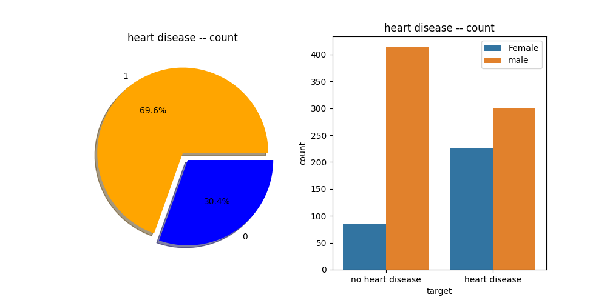
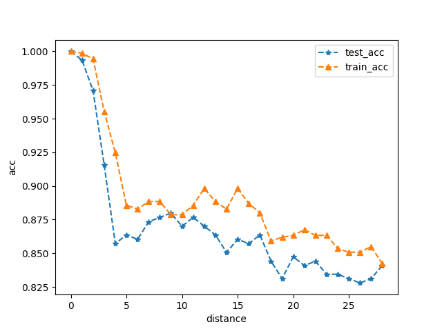

# Heart Disease Project
## Abstract
----------------
Our project's goal was to classify the different patients to see if they have a heart
disease or not. Using machine learning, we identified the differences between a heart disease
patient and a normal patient to further classify other patients if they are positive or negative of a heart disease.

## Main
-----------

The dataset we used consisted of 1025 patients. Out of these 1025 patients, 
we checked the balance between the positive and negative patients of heart disease and got these results.

Before we graphed out our patient's age, we predicted that people of old age over their 60s will consist of more positive patients. But after, we have realized that the patients of around age of 50 had the greatest number of positive heart disease patients. 

Most heart disease patients are seen to have a relatively high heart rate. In correlation, if we look at the graph above we should be seeing our younger heart disease patients to have a high heart rate. The results of the graph show that most of all heart disease patients are seen to have a high rate despite their age. 

<h3>(male - 1, female - 0)</h3> 
Using our dataset, after analyzing the ratio of the number of male to female patients, we found out that this dataset consisted of more male patients than female patients. Therefore using the ratio of positive to negative patients of both genders in our dataset, it is clear that there are more female patients that have a heart disease compared to the males. 

Fbs stands for "fasting blood sugar" in which, in high ammounts, is considered to usually lead to diabetes or a type of heart disease. Although we concluded that the majority of our heart diease patients lie in the 40-50 age range, it seems that the patients of age 50-60 had the highest fbs. 
 

In our dataset, cp standed for "chest pain". It is evident that as the degree of the chest pain increases, there tends to be a greater number of heart disease patients. Therefore we are able to conclude that chest pain does, indeed, have an impact toward possibily having a form of heart disease. However, we are unsure of the results of 3rd degreee of chest pain, in which we got lowest number of heart disease patients out of the four degrees of cp. 
 

This graph is used to depict the relationship between the resting blood pressure and chest pain of patients. 
 

