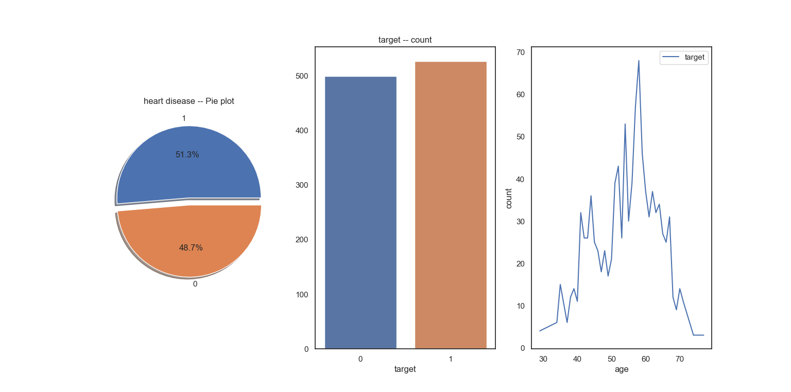
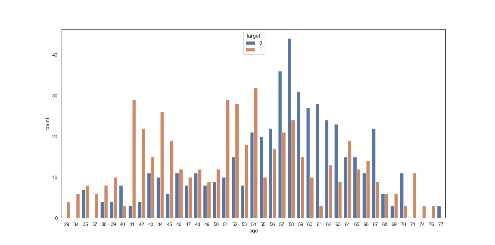
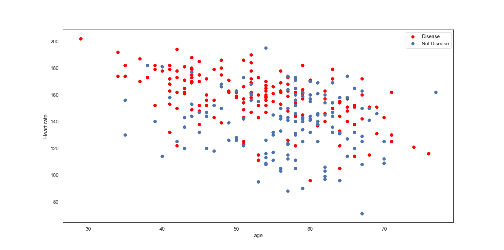
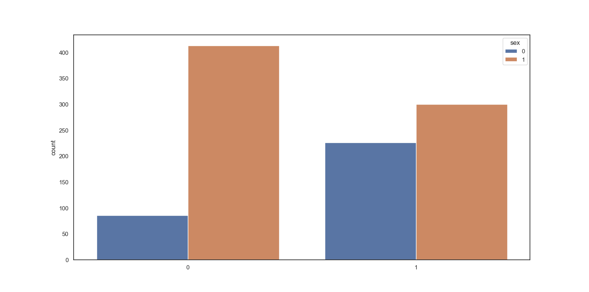
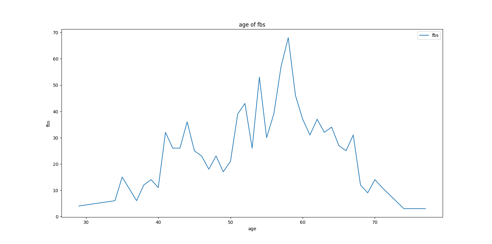
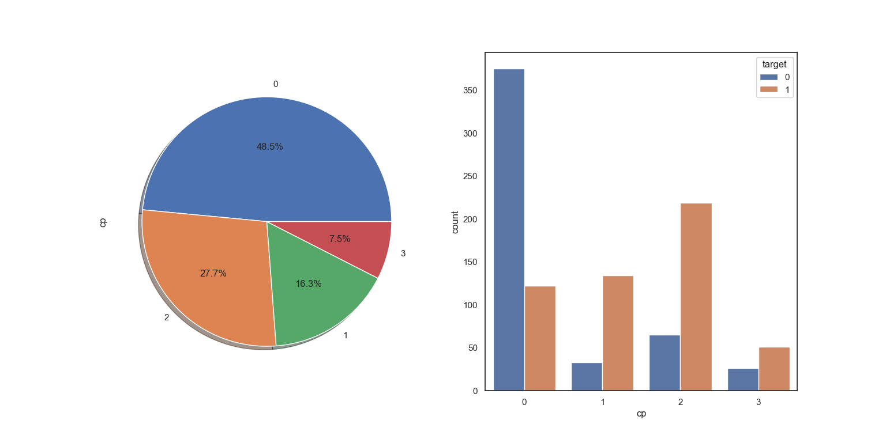
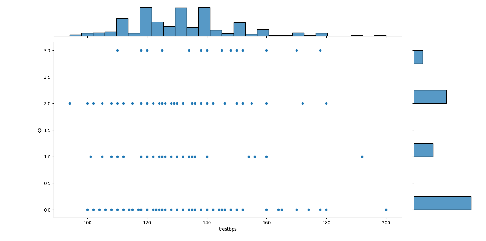

# Heart Disease Project
## Abstract
----------------
Our project's goal was to classify the different patients to see if they have a heart
disease or not. Using machine learning, we identified the differences between a heart disease
patient and a normal patient to further classify other patients if they are positive or negative of a heart disease.

## Main
-----------

The dataset we used consisted of 1025 patients. Out of these 1025 patients, 
we checked the balance between the positive and negative patients of heart disease and got these results.

Before we graphed out our patient's age, we predicted that people of old age over their 60s will consist of more positive patients. But after, we have realized that the patients of around age of 50 had the greatest number of positive heart disease patients. 

This graph allows us to have a better understanding of the age of the heart disease patients. Through this graph we are able to see the concentration of heart disease patients in the ages of 40-50. 

The blue represents the male patients while the orange represents the female patients. As shown, it is clear that more female patients tend to have a heart disease, compared to the males. 

Fbs stands for "fasting blood sugar" in which, in high ammounts, is considered to usually lead to diabetes or a type of heart disease. Although we concluded that the majority of our heart diease patients lie in the 40-50 age range, it seems that the patients of age 50-60 had the highest fbs. 
 

In our dataset, cp standed for "chest pain". It is evident that as the degree of the chest pain increases, there tends to be a greater number of heart disease patients. However, we are unsure of the results of 3rd degreee of chest pain, in which we got lowest number of heart disease patients out of the four degrees of cp. 
 

This graph is used to depict the relationship between the resting blood pressure and chest pain of patients. 
 
