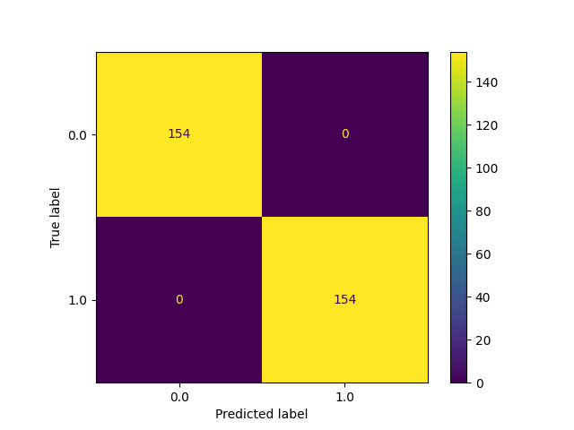

# Heart Disease Project
## Abstract
----------------
Our project's goal was to classify the different patients to see if they have a heart
disease or not. Using machine learning, we identified the differences between a heart disease
patient and a normal patient to further classify other patients if they are positive or negative of a heart disease.

## Main
-----------

The dataset we used consisted of 1025 patients. Out of these 1025 patients, 
we checked the balance between the positive and negative patients of heart disease and got these results.

Before we graphed out our patient's age, we predicted that people of old age over their 60s will consist of more positive patients. But after, we have realized that the patients of around age of 50 had the greatest number of positive heart disease patients. 

Most heart disease patients are seen to have a relatively high heart rate. In correlation, if we look at the graph above we should be seeing our younger heart disease patients to have a high heart rate. The results of the graph show that most of all heart disease patients are seen to have a high rate despite their age. 

<h3>(male - 1, female - 0)</h3> 
Using our dataset, after analyzing the ratio of the number of male to female patients, we found out that this dataset consisted of more male patients than female patients. Therefore using the ratio of positive to negative patients of both genders in our dataset, it is clear that there are more female patients that have a heart disease compared to the males. 

Fbs stands for "fasting blood sugar" in which, in high ammounts, is considered to usually lead to diabetes or a type of heart disease. Although we concluded that the majority of our heart diease patients lie in the 40-50 age range, it seems that the patients of age 50-60 had the highest fbs. 
 

In our dataset, cp standed for "chest pain". It is evident that as the degree of the chest pain increases, there tends to be a greater number of heart disease patients. Therefore we are able to conclude that chest pain does, indeed, have an impact toward possibily having a form of heart disease. However, we are unsure of the results of 3rd degreee of chest pain, in which we got lowest number of heart disease patients out of the four degrees of cp. 
 

This graph is used to depict the relationship between the resting blood pressure and chest pain of patients. 

## Machine learning 
----------------------------------

Using our analysis of our Heart Disease dataset, we used machine learning classification. For our machine learning classification, 
we will have to choose our desired features but first, our dataset shape is shown above. 

<h4> Before we performed our classification, we first need to choose our features. In order to choose our features, we found columns with strong correlations by using a heatmap.</h4>

There are two types of correlation analysis:
1. Positive Correlation (when the x and y relationship is +)  
   + x: height, y: weight
   + As a person's height increases, the weight of that person increases proportionally
2. Negative Correlation (when the x and y relationship is -)  
   + x: cigarette, y: health
   + As a person smokes more cigarettes, their health decreases
1. The heatmap result of the correlation between the target and 3 features (cp, slope, thalach) were identified as 0.4. Therefore, we know that these three features have almost no relation to the target's result. 

### training
----------

<h4>The machine learning model we used was KNN. These are the reaons behind using the KNN algorithm. </h4>

+ simple model design, easy to tune design
  + algorithm is simple
+ The knn algorithm classifies the results by searching the distance values
  + By searching using the distance values, the result of the new data is determined in the direction that contains more data within the given distance. 
+ training is not difficult and you can see the results immediately
  + It is called lazy learning because it does not learn in advance, but learns immediately, which implies the results
+ The current data is a numerical data, which is a good match for knn
  + knn can guarantee good performance for numerical data

<h4>With the knn algorithm, the training result of the distance values from 1 to 30 is as follows:</h4>

1. since there are different accuracy results depending on the distance, when using the knn alogrithm, we only used the distances with an accuracy of at least 90% to make our confusion metrix.
2. from the left, only the distance values of k=1~4 had the accuracy of at least 90%  
 

3. The confusion metrix table with the lowest performance had a distance value of 26 and an accuracy of 83%

### Deep Learning
